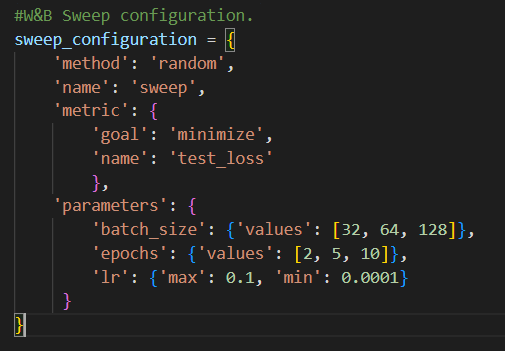
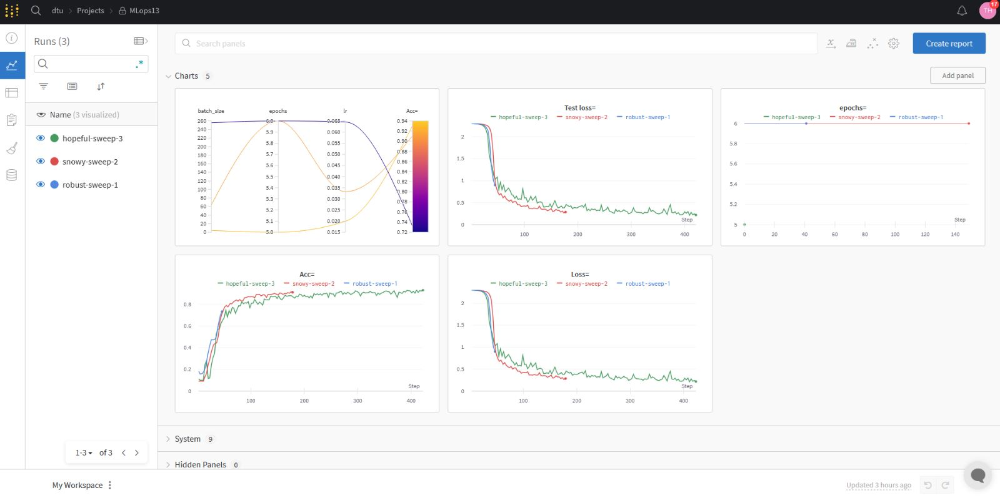
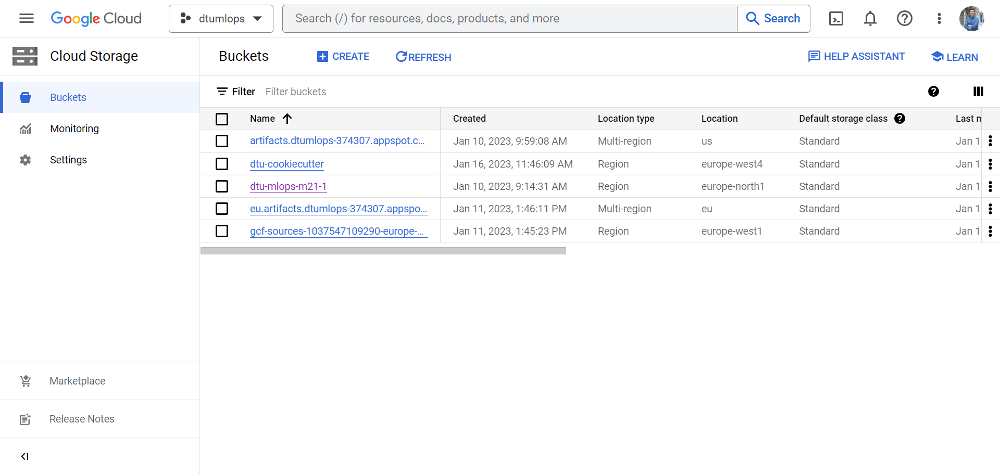
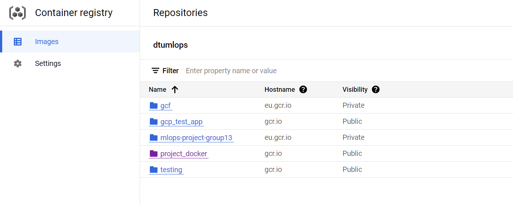
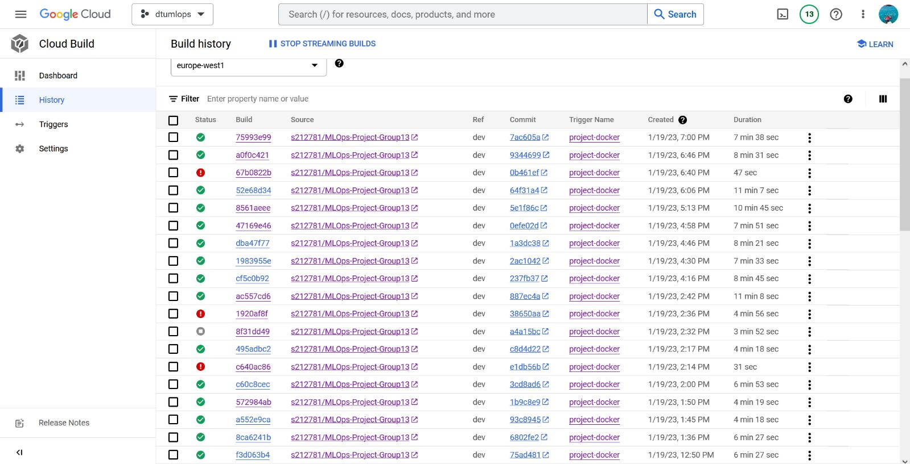
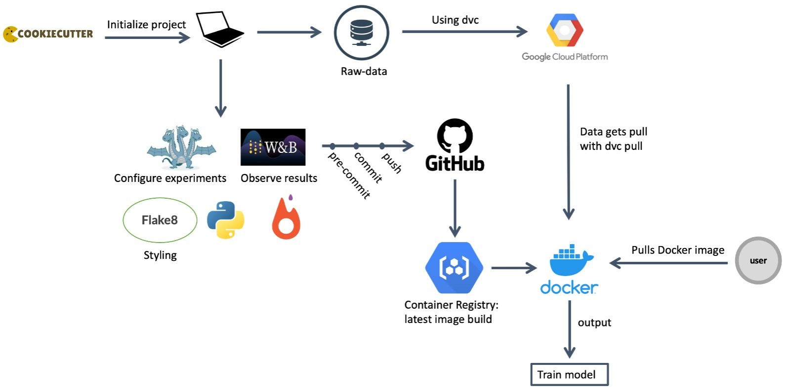

# Exam template for 02476 Machine Learning Operations

This is the report template for the exam. Please only remove the text formatted as with three dashes in front and behind
like:

```--- question 1 fill here ---```

where you instead should add your answers. Any other changes may have unwanted consequences when your report is auto
generated in the end of the course. For questions where you are asked to include images, start by adding the image to
the `figures` subfolder (please only use `.png`, `.jpg` or `.jpeg`) and then add the following code in your answer:

```markdown

```

In addition to this markdown file, we also provide the `report.py` script that provides two utility functions:

Running:

```bash
python report.py html
```

will generate an `.html` page of your report. After deadline for answering this template, we will autoscrape
everything in this `reports` folder and then use this utility to generate an `.html` page that will be your serve
as your final handin.

Running

```bash
python report.py check
```

will check your answers in this template against the constrains listed for each question e.g. is your answer too
short, too long, have you included an image when asked to.

For both functions to work it is important that you do not rename anything. The script have two dependencies that can
be installed with `pip install click markdown`.

### Project Checklist

### Week 1

* [x] Create a git repository
* [x] Make sure that all team members have write access to the github repository
* [x] Create a dedicated environment for you project to keep track of your packages
* [x] Create the initial file structure using cookiecutter
* [x] Fill out the `make_dataset.py` file such that it downloads whatever data you need and
* [x] Add a model file and a training script and get that running
* [x] Remember to fill out the `requirements.txt` file with whatever dependencies that you are using
* [x] Remember to comply with good coding practices (`pep8`) while doing the project
* [x] Do a bit of code typing and remember to document essential parts of your code
* [x] Setup version control for your data or part of your data
* [x] Construct one or multiple docker files for your code
* [x] Build the docker files locally and make sure they work as intended
* [x] Write one or multiple configurations files for your experiments
* [x] Used Hydra to load the configurations and manage your hyperparameters
* [ ] When you have something that works somewhat, remember at some point to to some profiling and see if
      you can optimize your code
* [x] Use Weights & Biases to log training progress and other important metrics/artifacts in your code. Additionally,
      consider running a hyperparameter optimization sweep.
* [ ] Use Pytorch-lightning (if applicable) to reduce the amount of boilerplate in your code

### Week 2

* [x] Write unit tests related to the data part of your code
* [x] Write unit tests related to model construction and or model training
* [x] Calculate the coverage.
* [x] Get some continuous integration running on the github repository
* [x] Create a data storage in GCP Bucket for you data and preferable link this with your data version control setup
* [x] Create a trigger workflow for automatically building your docker images
* [x] Get your model training in GCP using either the Engine or Vertex AI
* [ ] Create a FastAPI application that can do inference using your model
* [ ] If applicable, consider deploying the model locally using torchserve
* [ ] Deploy your model in GCP using either Functions or Run as the backend

### Week 3

* [ ] Check how robust your model is towards data drifting
* [ ] Setup monitoring for the system telemetry of your deployed model
* [ ] Setup monitoring for the performance of your deployed model
* [ ] If applicable, play around with distributed data loading
* [ ] If applicable, play around with distributed model training
* [ ] Play around with quantization, compilation and pruning for you trained models to increase inference speed

### Additional

* [x] Revisit your initial project description. Did the project turn out as you wanted?
* [x] Make sure all group members have a understanding about all parts of the project
* [x] Uploaded all your code to github

## Group information

### Question 1
> **Enter the group number you signed up on <learn.inside.dtu.dk>**
>
> Answer:

Group 13

### Question 2
> **Enter the study number for each member in the group**
>
> Example:
>
> *sXXXXXX, sXXXXXX, sXXXXXX*
>
> Answer:

s212781, s212383, s212711, s171198, s212488

### Question 3
> **What framework did you choose to work with and did it help you complete the project?**
>
> Answer length: 100-200 words.
>
> Example:
> *We used the third-party framework ... in our project. We used functionality ... and functionality ... from the*
> *package to do ... and ... in our project*.
>
> Answer:

For our project, we used the third party framework Pytorch Image Models (TIMM) since we decided to work on a computer vision project. From this framework we used the resnet152 model with its updated pretrained weights. We then added a fully connected layer at the end with dimension 120 since we are using the Stanford dogs image dataset which contains over 20000 dog samples for a total of 120 different dog breeds which is our number of classes. The selected framework is part of fast.ai and the hugging face ecosystem and it was used in order to be able to use a standard pre trained model in a quick and efficient way in order to pay attention to what really matters which is the pipeline and not the model deployment.

## Coding environment

> In the following section we are interested in learning more about you local development environment.

### Question 4

> **Explain how you managed dependencies in your project? Explain the process a new team member would have to go**
> **through to get an exact copy of your environment.**
>
> Answer length: 100-200 words
>
> Example:
> *We used ... for managing our dependencies. The list of dependencies was auto-generated using ... . To get a*
> *complete copy of our development enviroment, one would have to run the following commands*
>
> Answer:

To provide an easier setup for the development and contribution process, we have created a requirements.txt file for managing our dependencies in the project. The list of dependencies was auto-generated using pipreqs. The detailed list of the requirements to run our code can be found in the mentioned requirements.txt file located in the main project folder. To get a complete copy of our development enviroment, one would have to run the following commands: 
git clone https://github.com/s212781/MLOps-Project-Group13.git, pip install -r requirements.txt
This way the user will be ready to copy the evironment to the local computer and be able to contribute to the project development. If wished, the user could also create a new anaconda environment into which install the requirements.txt in order not to mess with the existing dependencies on his computer.

### Question 5

> **We expect that you initialized your project using the cookiecutter template. Explain the overall structure of your**
> **code. Did you fill out every folder or only a subset?**
>
> Answer length: 100-200 words
>
> Example:
> *From the cookiecutter template we have filled out the ... , ... and ... folder. We have removed the ... folder*
> *because we did not use any ... in our project. We have added an ... folder that contains ... for running our*
> *experiments.*
> Answer:

We have used the cookiecutter template in our project to organize our code starting from the very beginning. Cookiecutter is a standardized way of creating project structures. From the cookiecutter template we have filled out the folders and files that we found necessary. In the src folder we used the data subfolder for creating the make_dataset.py script which loops over the image directory and extracts the images with their labels. In the model subfolder of src we have defined the train and evaluation files. In data/external the raw images were stored and then the cropt compressed data is stored in data/processed. The models are then stored in the Models folder. The readme file was also completed. Many of the other foders were unnecessary for our implementation such as features and visualization thus we have removed or will remove them such as the notebooks folder and references folders. No new folders were added.

### Question 6

> **Did you implement any rules for code quality and format? Additionally, explain with your own words why these**
> **concepts matters in larger projects.**
>
> Answer length: 50-100 words.
>
> Answer:

Documentation is important for code maintanence and further development. It saves us a lot of time when looking at code written by someone else. Styling is also important for everyone to understand and contribute easily. We have used "flake8 . --max-line-length 100" to check if our code follows pep8 standard, and "black . --line-length 100" to make the corresponding modifications. Also, some changes needed to be done manually as black didn't corrected them all, as deleting the unsued imports, or removing the space before ":" or ",", as examples. This process managed to leave only 3 warnings from the flake8.

## Version control

> In the following section we are interested in how version control was used in your project during development to
> corporate and increase the quality of your code.

### Question 7

> **How many tests did you implement?**
>
> Answer:

We have implemented a data test and a model test.

### Question 8

> **What is the total code coverage (in percentage) of your code? If you code had an code coverage of 100% (or close**
> **to), would you still trust it to be error free? Explain you reasoning.**
>
> **Answer length: 100-200 words.**
>
> Example:
> *The total code coverage of code is X%, which includes all our source code. We are far from 100% coverage of our **
> *code and even if we were then...*
>
> Answer:

Our total code coverage of code is 100%, but this includes only the model and the data code. Therefore, this has to be seen critically, since there are a lot of other code parts that are not tested. For demonstration purposes we focused on the main code parts for testing. There are a lot of other possible tests that could have been implemented. For instance a training with one epoch could have been checked to ensure the training is working. Also, more concrete test like testing the loss function or gradient computation could have been tested. However, unit testing are not enough for us to cover integration errors. It can not test non-functional attributes, such as scalability, reproducability etc.


### Question 9

> **Did you workflow include using branches and pull requests? If yes, explain how. If not, explain how branches and**
> **pull request can help improve version control.**
>
> Answer length: 100-200 words.
>
> Example:
> *We made use of both branches and PRs in our project. In our group, each member had an branch that they worked on in*
> *addition to the main branch. To merge code we ...*
>
> Answer:

During our project development, we used git and Github to collaborate easily with each other and do a proper version control of our code. It helped us keep track of the changes made in the code. We could follow what changes were made, who made them and when they were made. We mostly made use of branches in our project. All of the group members mostly worked on different branches to avoid conflicts when developing simultaneously. Initially each member was to have his own branch but in the end, branches were created for the specific task under development. Examples of these are: dev, model, test, report, hydra_logging for different purposes. We didn't use pull requests since our repo didn't have any safety features however we did not merge any branch with the main until everyone was sure that the branch to merge was working and all members approved of this merge.

### Question 10

> **Did you use DVC for managing data in your project? If yes, then how did it improve your project to have version**
> **control of your data. If no, explain a case where it would be beneficial to have version control of your data.**
>
> Answer length: 100-200 words.
>
> Example:
> *We did make use of DVC in the following way: ... . In the end it helped us in ... for controlling ... part of our*
> *pipeline*
>
> Answer:

Data Version Control helps us take versionig of data, models and experiments in our project. One can track and save data and machine learning models, create and switch between the versions and compare model metrics among experiments. For the data, the most important aspect of data version control is that it allows us to control the version of data with huge sizes that we use for our experiments. We used DVC from iterative ai in our project to keep track of our data. This helped us about data sharing and ensuring reproducibility in our project since we were able to push and pull the data from a google cloud bucket. This way we can store large amounts of compressed data in the cloud instead of on our computers or github repo. 

### Question 11

> **Discuss you continues integration setup. What kind of CI are you running (unittesting, linting, etc.)? Do you test**
> **multiple operating systems, python version etc. Do you make use of caching? Feel free to insert a link to one of**
> **your github actions workflow.**
>
> Answer length: 200-300 words.
>
> Example:
> *We have organized our CI into 3 separate files: one for doing ..., one for running ... testing and one for running*
> *... . In particular for our ..., we used ... .An example of a triggered workflow can be seen here: <weblink>*
>
> Answer:

Our CI setup is based on pytest unittests and github actions. This allowed us to collaborate and integrate our new code continously at the sam time. We created unittests to check possible errors in the code before it gets integrated. One test adresses the model and checks all input and output dimentions as well as the data propagation through the whole network. The other test makes sure that the data is in the right format, the dataset has the right length and all lables are represented. After implementing these tests we designed a workflow that is running on github actions, which is triggered by each push to the branch. This workflow creates a new environment within github actions, which is why we first install all requirement packages. The dvc authentification did not work, since no one of us got the in the lecture mentioned cache file (I wonder why?), therefore we had to use dummy data for the unittests. Also, we applied auto linting based on the black formatter. So, when we push new code to the github repository, the code is checked for errors first by the unittests and then it is formatted by black. Due to a lack of time, we did not implement branch protection rules. This could have added more safety and stability to out coding process.

## Running code and tracking experiments

> In the following section we are interested in learning more about the experimental setup for running your code and
> especially the reproducibility of your experiments.

### Question 12

> **How did you configure experiments? Did you make use of config files? Explain with coding examples of how you would**
> **run a experiment.**
>
> Answer length: 50-100 words.
>
> Example:
> *We used a simple argparser, that worked in the following way: python my_script.py --lr 1e-3 --batch_size 25*
>
> Answer:

To configure our experiments, we needed to use a structure to keep track of and adjust our hyperparameters in an organised way. For this purpose, we used Hydra with configuration files for our experiments to keep track of our hyperparameters. We created a config folder which contains a folder named experiments with two different experiment scripts with a different combination of hyperparameters and then a script named default_config.py which chooses which of the two defined experiments to launch. Therefore in the code, then you use the hydra main function line to access the .yaml and read the values of interest.

### Question 13

> **Reproducibility of experiments are important. Related to the last question, how did you secure that no information**
> **is lost when running experiments and that your experiments are reproducible?**
>
> Answer length: 100-200 words.
>
> Example:
> *We made use of config files. Whenever an experiment is run the following happens: ... . To reproduce an experiment*
> *one would have to do ...*
>
> Answer:

For the reproducibility of our experiments, we made use of config files and Hydra. We can store our hyperparameters for the model in config files and distinguish them for each experiment performed. Whenever an experiment is run the following happens: Hydra writes the results to a folder called outputs, in a sub folder with the time logs of the experiment. This way we can follow each experiment performed. This way we make sure that no information is lost. To reproduce an experiment one would have to run the main script by adjusting it to the relative config file of the experiment. 

### Question 14

> **Upload 1 to 3 screenshots that show the experiments that you have done in W&B (or another experiment tracking**
> **service of your choice). This may include loss graphs, logged images, hyperparameter sweeps etc. You can take**
> **inspiration from [this figure](figures/wandb.png). Explain what metrics you are tracking and why they are**
> **important.**
>
> Answer length: 200-300 words + 1 to 3 screenshots.
>
> Example:
> *As seen in the first image when have tracked ... and ... which both inform us about ... in our experiments.*
> *As seen in the second image we are also tracking ... and ...*
>
> Answer:

Through Weights & Biases (W&B) we have been able to track some variables. This includes variables such as the training loss, the validation loss and the accuracy. These were tracked through a very simple wandb.log which manages to plot the different varaibles in different graphs. These three are important to observe since they help the user follow the model's behaviour. We wish for the losses to converge to 0 whilst the accuracy increases. Another varaible followed is the number of epochs to be able to track at which stae the training of the model is. At the same time, we also did hyperparameter sweeping where we define in a dictionary the metric of interest to follow; this being the validation loss for example. When sweeping you have to define that you wish to minimize such variable (since we are talking of loss) by using the bayes method. Then we define the parameters we are going to sweep through. In other words, we are going to try different values for batch size, epochs and learning rate in order to minimize the validation loss. All this is done through the wandb sweep utility function. Some of these example plots are shown in the screenshots below:



The next image shows the metrics logged into wandb and a plot with all the logged metric whilst doing the sweep configuration. This proves that wandb was successfully implemented together with a sweep configuration to log all our results.



### Question 15

> **Docker is an important tool for creating containerized applications. Explain how you used docker in your**
> **experiments? Include how you would run your docker images and include a link to one of your docker files.**
>
> Answer length: 100-200 words.
>
> Example:
> *For our project we developed several images: one for training, inference and deployment. For example to run the*
> *training docker image: `docker run trainer:latest lr=1e-3 batch_size=64`. Link to docker file: <weblink>*
>
> Answer:

We used docker in order to create docker images. Most of the docker images created were for local training although these can be differentiated between those which use the full dataset and those trained with a lite version of the dataset with 3 to 7 classes. Since we used the Cloud Build service, every time something is pushed to the main branch in our repo, the latest docker image is created being up to date. Also, the docker image always contains the latest version of the data due to the implementation of dvc pull. We would run the docker image as: docker run trainer:latest. The link to one of our docker images is: gcr.io/dtumlops-374307/project_docker@sha256:58f012a11cf43c5c0b034966d7b2a9ecef8bc9be102e91c73628ffdbddd7270c.

### Question 16

> **When running into bugs while trying to run your experiments, how did you perform debugging? Additionally, did you**
> **try to profile your code or do you think it is already perfect?**
>
> Answer length: 100-200 words.
>
> Example:
> *Debugging method was dependent on group member. Some just used ... and others used ... . We did a single profiling*
> *run of our main code at some point that showed ...*
>
> Answer:

Debugging is important to find what is wrong in our code and determine how it can be fixed. For debugging, we mostly used the python debugger for visual studio code debugger. We benefited from using breakpoints to debug our code by running it in debug mode. We can perform many different operations such as step into, step over and step out to run the code step by step and this way it becomes easier to figure out the problems in our code. Profiling can help us optimize our code. We can do this by searching for bottlenecks and speeding up our code using profilers, however we did not manage to do this step since we prioratized others. 


## Working in the cloud

> In the following section we would like to know more about your experience when developing in the cloud.

### Question 17

> **List all the GCP services that you made use of in your project and shortly explain what each service does?**
>
> Answer length: 50-200 words.
>
> Example:
> *We used the following two services: Engine and Bucket. Engine is used for... and Bucket is used for...*
>
> Answer:

We used multiple services. The first one is Buckets for storing our data. Then we also used Cloud Engine in order to launch our virtual machines. Also, we used Cloud Registry to register all of our docker images created and then finally we used cloud Build which uses some triggers in the github in order to create the latest docker image when something new is pushed to the main branch in the repo.

### Question 18

> **The backbone of GCP is the Compute engine. Explained how you made use of this service and what type of VMs**
> **you used?**
>
> Answer length: 50-100 words.
>
> Example:
> *We used the compute engine to run our ... . We used instances with the following hardware: ... and we started the*
> *using a custom container: ...*
>
> Answer:

The compute engine was used in order to create instances/our Virtual Machines. These had to have certain characteristics such as using the region "europe-west4" and zone "europe-west4-b" in order to be able to use the GPU NVIDIA T4 with the n1-standard-4 (4CPU, 16GB) which allows to have a decent GPU with the enough amount of storage that we need. Once these characteristics were chosen, a container was deployed (using one of our docker images).


### Question 19

> **Insert 1-2 images of your GCP bucket, such that we can see what data you have stored in it.**
> **You can take inspiration from [this figure](figures/bucket.png).**
>
> Answer:



### Question 20

> **Upload one image of your GCP container registry, such that we can see the different images that you have stored.**
> **You can take inspiration from [this figure](figures/registry.png).**
>
> Answer:



### Question 21

> **Upload one image of your GCP cloud build history, so we can see the history of the images that have been build in**
> **your project. You can take inspiration from [this figure](figures/build.png).**
>
> Answer:




### Question 22

> **Did you manage to deploy your model, either in locally or cloud? If not, describe why. If yes, describe how and**
> **preferably how you invoke your deployed service?**
>
> Answer length: 100-200 words.
>
> Example:
> *For deployment we wrapped our model into application using ... . We first tried locally serving the model, which*
> *worked. Afterwards we deployed it in the cloud, using ... . To invoke the service an user would call*
> *`curl -X POST -F "file=@file.json"<weburl>`*
>
> Answer:

We did not manage to deploy our model either locally nor on the cloud. We did not manage to do so because we were stuck dealing with other issues such as running our code on GPU on a Virtual Machine which ended up being much more complicated than expected due to the fact that many things had to favourably align in order for the training to happen. Since this took much of our time we though about how we could have done it if more time. We would have created a script that would have gotten the latest image created form the latest push on the main branch of our repo together with our deploy model script which we had ready in case we got to this point.

### Question 23

> **Did you manage to implement monitoring of your deployed model? If yes, explain how it works. If not, explain how**
> **monitoring would help the longevity of your application.**
>
> Answer length: 100-200 words.
>
> Example:
> *We did not manage to implement monitoring. We would like to have monitoring implemented such that over time we could*
> *measure ... and ... that would inform us about this ... behaviour of our application.*
>
> Answer:

Monitoring is important after deploying a machine learning model to ensure its durability over time. We did not manage to implement monitoring for our project. We would like to have monitoring implemented such that over time we could keep track of the drift in the data and prevent our model from being useless over time. In our example, the dog breeds and the dogs' appearences will probably remain same, but the image qualities and the picture attributes may change over time and monitoring can help us track these changes and act upon them. We could also benefit from telemetry to check our system daily in a real-life example.

### Question 24

> **How many credits did you end up using during the project and what service was most expensive?**
>
> Answer length: 25-100 words.
>
> Example:
> *Group member 1 used ..., Group member 2 used ..., in total ... credits was spend during development. The service*
> *costing the most was ... due to ...*
>
> Answer:

At the end, almost 60$ of credit was used with most of it going to the Compute Engine and some for the Cloud Storage. Other services also used up some credit but not that significant.


## Overall discussion of project

> In the following section we would like you to think about the general structure of your project.

### Question 25

> **Include a figure that describes the overall architecture of your system and what services that you make use of.**
> **You can take inspiration from [this figure](figures/overview.png). Additionally in your own words, explain the**
> **overall steps in figure.**
>
> Answer length: 200-400 words
>
> Example:
>
> *The starting point of the diagram is our local setup, where we integrated ... and ... and ... into our code.*
> *Whenever we commit code and puch to github, it auto triggers ... and ... . From there the diagram shows ...*
>
> Answer:



The starting point of the diagram is our local setup, where the computer symbol is referring to each one of the team developers. The first step is to create a GitHub repository and clone in into each one of the local machines. After that, use cookie cutter to create a data science template in order to achieve a better organization of the project. Furthermore, the use of an Anaconda environment allows each one of the local machines to work with the same setup configuration. On one hand, Pytorch was used to reduce unnecessary code and make the coding overview simpler for the developers. On the other hand, caring about the styling of the code is a good practice that’s why we installed flake8 and black, to check and correct the code following the standardization from Pep8. Also, we implemented the hyperparameters using Hydra, and created different experiments config-files where a specific configuration of the parameters was settled for each experiment. Then we used "Weights&Biases" to log and visualize the training experiments applying the wandb configuration into our code. Finally, each developer was able to commit and push its work to GitHub repository so that another member team could pull it into his computer if needed. In addition, pytest test functions were created where the code functions are checked for its correctness. As soon as there are new push or pull requests on the main branch, Github actions runs this pytests.

At the same time, dvc is used in order to obtain the data that is on the Google Cloud storage, so in that way the data is not inside the GitHub repository. Also, each version of the data can be pushed and pulled with DVC. 

On the other hand, we created a trigger in the form of a .yaml file which triggered a build and push of a docker image corresponding to the newest push to the main repository on GitHub. After the docker image is build, it is launched using the compute engine provided by Google Cloud, the image trains a model to classify the breed of certain dogs and this model is the output from our docker container.Finally, any external user could access the code just pulling the docker image from docker.

### Question 26

> **Discuss the overall struggles of the project. Where did you spend most time and what did you do to overcome these**
> **challenges?**
>
> Answer length: 200-400 words.
>
> Example:
> *The biggest challenges in the project was using ... tool to do ... . The reason for this was ...*
>
> Answer:

Throughout the project, we had many problems to solve. some of these problems were at an individual level whilst others as a group development problem. Individually some of us had really big challenge with dvc and being able to pull the data from the cloud. A lot of time was spent on trying to fix it. Others had problems with docker and certain permissions. Collectively, hydra and w&b was challenging since in order to use hydra and the configuration files for the hyperparameters these have to be used in functions without any arguments and due to our code structure we found it difficult adapting it to it. Whereas w&b was challenging when creating the sweep configuration. Firstly, we tried doing it on a .yaml but did not find the way to import it so had to end up using the dictionary configuration which also gave problems when initialising the agent. Another problem was implememtning caching since there was a path error which seemed like a simple error to fix but ended up without being able to fix it. It is a pitty since caching would work if the path issue was solved.

With regards to the google cloud service we found it challenging to share the project with the rest of the teammates so we could all work on the same one. Giving these permissions to the rest of the team members was difficult to find but in the end was successful. We also figured out that maybe instead of spending so much time on these permissions we could all just have uploaded the data to our own project and work from there. Finally, most of our struggles came with spending a lot of time on configuring the instances as well, since the regions are very specific where you are allowed to mount GPU's. We spoke with many other groups that picked data that didn't need to use GPU's and we think that is also where we struggled a lot. Our data was very detailed and therefore needed GPU's to run it. This tied our hands when it came to testing our scripts. We needed GPU's and very heavily reliant on the Google Cloud as a result.

Overall we feel like the knowledge of the different subjects individually have been acquired but the tricky part was gluing them all together.

### Question 27

> **State the individual contributions of each team member. This is required information from DTU, because we need to**
> **make sure all members contributed actively to the project**
>
> Answer length: 50-200 words.
>
> Example:
> *Student sXXXXXX was in charge of developing of setting up the initial cookie cutter project and developing of the*
> *docker containers for training our applications.*
> *Student sXXXXXX was in charge of training our models in the cloud and deploying them afterwards.*
> *All members contributed to code by...*
>
> Answer:

-s171198 wrote python scripts for training, applying the pretrained models, adding the data to the Google Cloud and integrating dvc. Initialised instances, developed the trained model.pth file for evaluation of the trained model. Setting up docker triggers for the cloud build and integrating the github workflow.

-s212781 setup repository and help coding with loading and setting up data. Complying with good coding practices by using black, pep8 and flake and code typing. Set up version control for the data and wrote configuration files for experiments with hydra. Also used W&B to log progress and hyperparameter optimization sweep. In charge of report.

-s212488 complying with good coding practices by using black, pep8 and flake as well as code typing and documenting. Set up version control for the data and wrote configuration files for experiments with hydra. Also used W&B to log progress and hyperparameter optimization sweep. Helped with coding. Help on report.

-s212711 did unit testing and continuous integrations as well as trying to implement the 'deploy_model.py' which should predict the class of a new unseen image.

-s212383 did unit testing, caching and continuous integration and setting up version control. He was responsible for the report and helped on coding.


