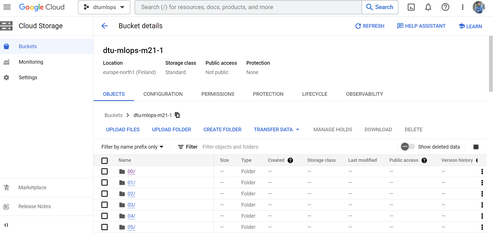

# Exam template for 02476 Machine Learning Operations

This is the report template for the exam. Please only remove the text formatted as with three dashes in front and behind
like:

```--- question 1 fill here ---```

where you instead should add your answers. Any other changes may have unwanted consequences when your report is auto
generated in the end of the course. For questions where you are asked to include images, start by adding the image to
the `figures` subfolder (please only use `.png`, `.jpg` or `.jpeg`) and then add the following code in your answer:

```markdown

```

In addition to this markdown file, we also provide the `report.py` script that provides two utility functions:

Running:

```bash
python report.py html
```

will generate an `.html` page of your report. After deadline for answering this template, we will autoscrape
everything in this `reports` folder and then use this utility to generate an `.html` page that will be your serve
as your final handin.

Running

```bash
python report.py check
```

will check your answers in this template against the constrains listed for each question e.g. is your answer too
short, too long, have you included an image when asked to.

For both functions to work it is important that you do not rename anything. The script have two dependencies that can
be installed with `pip install click markdown`.

## Group information

### Question 1
> **Enter the group number you signed up on <learn.inside.dtu.dk>**
>
> Answer:

Group 13

### Question 2
> **Enter the study number for each member in the group**
>
> Example:
>
> *sXXXXXX, sXXXXXX, sXXXXXX*
>
> Answer:

s212781, s212383, s212711, s171198, s212488

### Question 3
> **What framework did you choose to work with and did it help you complete the project?**
>
> Answer length: 100-200 words.
>
> Example:
> *We used the third-party framework ... in our project. We used functionality ... and functionality ... from the*
> *package to do ... and ... in our project*.
>
> Answer:

--- question 3 fill here ---

We used the third party framework Pytorch image models in our project as we decided to work on a computer vision project. We were using the Stanford dogs image dataset to classify different dog breeds which contains 20,850 samples of 120 different dog breeds. First we needed to perform image data pre-processing on the dataset. For this purpose we used PIL (Python Image Library) and Opencv (cv2) to crop and process the images. Then we used transforms from torchvision to perform necessary transforms on the images. Then finally to build our deep learning model, we used optim and nn modules from torch in our project.

## Coding environment

> In the following section we are interested in learning more about you local development environment.

### Question 4

> **Explain how you managed dependencies in your project? Explain the process a new team member would have to go**
> **through to get an exact copy of your environment.**
>
> Answer length: 100-200 words
>
> Example:
> *We used ... for managing our dependencies. The list of dependencies was auto-generated using ... . To get a*
> *complete copy of our development enviroment, one would have to run the following commands*
>
> Answer:

--- question 4 fill here ---

To provide an easier setup for the development and contribution process, we have created requirements.txt file for managing our dependencies in the project. The list of dependencies was auto-generated using pipreqs. The detailed list of the requirements to run our code can be find in requirements.txt file located in the main project folder. To get a complete copy of our development enviroment, one would have to run the following commands: 
git clone https://github.com/s212781/MLOps-Project-Group13.git, pip install -r requirements.txt
This way the user will be ready to copy the evironment to the local computer and be able to contribute to the project development.

### Question 5

> **We expect that you initialized your project using the cookiecutter template. Explain the overall structure of your**
> **code. Did you fill out every folder or only a subset?**
>
> Answer length: 100-200 words
>
> Example:
> *From the cookiecutter template we have filled out the ... , ... and ... folder. We have removed the ... folder*
> *because we did not use any ... in our project. We have added an ... folder that contains ... for running our*
> *experiments.*
> Answer:

--- question 5 fill here ---

We have used the cookicutter template in our project to organize our code starting from the very beginning. Cooki cutter is a standardized way of creating project structures. From the cookiecutter template we have filled out the folders and files that we found necessary. These folders are the readme , models, reports, requirements, src(_init_, make_dataset, build_features, predict_model, train_model) and toxi_ini folder. However, some default folders were unnecessary for our implementation . Thus we have removed the notebooks folder, as we did not use any jupyter notebooks in our project. We also removed references folder since it was unrelated with our tasks. 
We haven't added new folders.

### Question 6

> **Did you implement any rules for code quality and format? Additionally, explain with your own words why these**
> **concepts matters in larger projects.**
>
> Answer length: 50-100 words.
>
> Answer:

--- question 6 fill here ---

We have used flake8 to adjust our code and check that our code is pep8 compliant. It is important that our code is understandable for human readers. We have grouped a well organized code in two subtitles: documentation and styling. Documentation is important for code maintanence and further development. It saves us a lot of time, especially when re-visiting an old project, or a code written by someone else. Styling is also important for everyone to understand and contribute easily. 

## Version control

> In the following section we are interested in how version control was used in your project during development to
> corporate and increase the quality of your code.

### Question 7

> **How many tests did you implement?**
>
> Answer:

--- question 7 fill here ---

We have implemented a data test and a model test. Details are in the CI setup question.

### Question 8

> **What is the total code coverage (in percentage) of your code? If you code had an code coverage of 100% (or close**
> **to), would you still trust it to be error free? Explain you reasoning.**
>
> **Answer length: 100-200 words.**
>
> Example:
> *The total code coverage of code is X%, which includes all our source code. We are far from 100% coverage of our **
> *code and even if we were then...*
>
> Answer:

--- question 8 fill here ---

We have used unit testing in our code to prevent possible errors during data loading and processing as well as model creation. Then we have calculated the coverage in our code with these unit tests. The total code coverage of our code is X%, which includes all our source code. We are far from 100% coverage of our code and even if we were then we would not be 100% sure about our code being error free. Unit testing helps us detect which functions in our code could possibly fail, which helps us detect the problems easier and act on them. However, unit testing are not enough for us to cover integration errors. It can not test non-functional attributes, such as scalability, reproducability etc.  
TO BE UPDATED* coverage percent


### Question 9

> **Did you workflow include using branches and pull requests? If yes, explain how. If not, explain how branches and**
> **pull request can help improve version control.**
>
> Answer length: 100-200 words.
>
> Example:
> *We made use of both branches and PRs in our project. In our group, each member had an branch that they worked on in*
> *addition to the main branch. To merge code we ...*
>
> Answer:

--- question 9 fill here ---

During our project development, we used git and Github to collaborate easier and do a proper version control of our code. It helped us keep track of the changes made in the code. We could follow what changes were made, who made them and when they were made. We made use of branches in our project. All of the group members mostly worked on different branches to avoid conflicts when developing simultaneously. Other than the main branch, we had branches dev, model, test, report for different purposes. We also used pull requests, which helped us implement different parts of the code without affecting the main branch.

### Question 10

> **Did you use DVC for managing data in your project? If yes, then how did it improve your project to have version**
> **control of your data. If no, explain a case where it would be beneficial to have version control of your data.**
>
> Answer length: 100-200 words.
>
> Example:
> *We did make use of DVC in the following way: ... . In the end it helped us in ... for controlling ... part of our*
> *pipeline*
>
> Answer:

--- question 10 fill here ---

Data Version Control helps us take versionig of data, models and experiments in our project. One can track and save data and machine learning models, create and switch between the versions and compare model metrics among experiments. For the data, the most important aspect of data version control is that it allows us to control the version of data with huge sizes that we use for our experiments. We used DVC from iterative ai in our project to keep track of our data. This helped us about data sharing and ensuring reproducibility in our project. The data sharing became easier with DVC.

### Question 11

> **Discuss you continues integration setup. What kind of CI are you running (unittesting, linting, etc.)? Do you test**
> **multiple operating systems, python version etc. Do you make use of caching? Feel free to insert a link to one of**
> **your github actions workflow.**
>
> Answer length: 200-300 words.
>
> Example:
> *We have organized our CI into 3 separate files: one for doing ..., one for running ... testing and one for running*
> *... . In particular for our ..., we used ... .An example of a triggered workflow can be seen here: <weblink>*
>
> Answer:

--- question 11 fill here ---

We used unit testing to test the dataset and the model. For the testing part of the setup, we test dataset length, image type, and whether the label represantations are correct or not. For the model, we test the tensor input and output dimensions. We also use linting by black and

TO BE COMPLETED*

## Running code and tracking experiments

> In the following section we are interested in learning more about the experimental setup for running your code and
> especially the reproducibility of your experiments.

### Question 12

> **How did you configure experiments? Did you make use of config files? Explain with coding examples of how you would**
> **run a experiment.**
>
> Answer length: 50-100 words.
>
> Example:
> *We used a simple argparser, that worked in the following way: python my_script.py --lr 1e-3 --batch_size 25*
>
> Answer:

--- question 12 fill here ---

To configure our experiments, we needed to use a structure to keep track of and adjust our hyperparameters in an organised way. For this purpose, we used Hydra and config files for our experiments. With Hydra, we can write config files and keep track of our hyperparameters in experiments. This way we can obtain a more clear picture of the model configuration and it becomes easier to do the version control of the configuration.

### Question 13

> **Reproducibility of experiments are important. Related to the last question, how did you secure that no information**
> **is lost when running experiments and that your experiments are reproducible?**
>
> Answer length: 100-200 words.
>
> Example:
> *We made use of config files. Whenever an experiment is run the following happens: ... . To reproduce an experiment*
> *one would have to do ...*
>
> Answer:

--- question 13 fill here ---

For the reproducibility of our experiments, we made use of config files and Hydra. We can store our hyperparameters for the model in config files and distinguish them for each experiment performed. Whenever an experiment is run the following happens: Hydra writes the results to a folder called outputs, in a sub folder with the time logs of the experiment. This way we can follow each experiment performed. This way we make sure that no information is lost. To reproduce an experiment one would have to run the main script by adjusting it to the relative config file of the experiment. 

### Question 14

> **Upload 1 to 3 screenshots that show the experiments that you have done in W&B (or another experiment tracking**
> **service of your choice). This may include loss graphs, logged images, hyperparameter sweeps etc. You can take**
> **inspiration from [this figure](figures/wandb.png). Explain what metrics you are tracking and why they are**
> **important.**
>
> Answer length: 200-300 words + 1 to 3 screenshots.
>
> Example:
> *As seen in the first image when have tracked ... and ... which both inform us about ... in our experiments.*
> *As seen in the second image we are also tracking ... and ...*
>
> Answer:

--- question 14 fill here ---

TO BE COMPLETED*

### Question 15

> **Docker is an important tool for creating containerized applications. Explain how you used docker in your**
> **experiments? Include how you would run your docker images and include a link to one of your docker files.**
>
> Answer length: 100-200 words.
>
> Example:
> *For our project we developed several images: one for training, inference and deployment. For example to run the*
> *training docker image: `docker run trainer:latest lr=1e-3 batch_size=64`. Link to docker file: <weblink>*
>
> Answer:

--- question 15 fill here ---

TO BE COMPLETED*

### Question 16

> **When running into bugs while trying to run your experiments, how did you perform debugging? Additionally, did you**
> **try to profile your code or do you think it is already perfect?**
>
> Answer length: 100-200 words.
>
> Example:
> *Debugging method was dependent on group member. Some just used ... and others used ... . We did a single profiling*
> *run of our main code at some point that showed ...*
>
> Answer:

--- question 16 fill here ---

Debugging is important to find what is wrong in our code and determine how it can be fixed. For debugging, we mostly used the python debugger for visual studio code debugger. We benefited from using breakpoints to debug our code by running it in debug mode. We can perform many different operations such as step into, step over and step out to run the code step by step and this way it becomes easier to figure out the problems in our code. Profiling can help us optimize our code. We can do this by searching for bottlenecks and speeding up our code using profilers. 


## Working in the cloud

> In the following section we would like to know more about your experience when developing in the cloud.

### Question 17

> **List all the GCP services that you made use of in your project and shortly explain what each service does?**
>
> Answer length: 50-200 words.
>
> Example:
> *We used the following two services: Engine and Bucket. Engine is used for... and Bucket is used for...*
>
> Answer:

--- question 17 fill here ---

We used the following two services: Virtual Machine and Bucket. A virtual machine is an instance of a computer in the cloud. We can run applications and programs as if it were in our local computers. A bucket is used for data storage in google cloud platform services, which are associated with our project. We used it to store our dataset in the cloud.

### Question 18

> **The backbone of GCP is the Compute engine. Explained how you made use of this service and what type of VMs**
> **you used?**
>
> Answer length: 50-100 words.
>
> Example:
> *We used the compute engine to run our ... . We used instances with the following hardware: ... and we started the*
> *using a custom container: ...*
>
> Answer:

--- question 18 fill here ---

We used the compute engine to run our ... . We used instances with the following hardware: ... and we started the using a custom container: ...

TO BE COMPLETED*


### Question 19

> **Insert 1-2 images of your GCP bucket, such that we can see what data you have stored in it.**
> **You can take inspiration from [this figure](figures/bucket.png).**
>
> Answer:

--- question 19 fill here ---


### Question 20

> **Upload one image of your GCP container registry, such that we can see the different images that you have stored.**
> **You can take inspiration from [this figure](figures/registry.png).**
>
> Answer:

--- question 20 fill here ---



### Question 21

> **Upload one image of your GCP cloud build history, so we can see the history of the images that have been build in**
> **your project. You can take inspiration from [this figure](figures/build.png).**
>
> Answer:

--- question 21 fill here ---

TO BE COMPLETED*
THE PAGE LOOKS EMPTY FOR US


### Question 22

> **Did you manage to deploy your model, either in locally or cloud? If not, describe why. If yes, describe how and**
> **preferably how you invoke your deployed service?**
>
> Answer length: 100-200 words.
>
> Example:
> *For deployment we wrapped our model into application using ... . We first tried locally serving the model, which*
> *worked. Afterwards we deployed it in the cloud, using ... . To invoke the service an user would call*
> *`curl -X POST -F "file=@file.json"<weburl>`*
>
> Answer:

--- question 22 fill here ---

### Question 23

> **Did you manage to implement monitoring of your deployed model? If yes, explain how it works. If not, explain how**
> **monitoring would help the longevity of your application.**
>
> Answer length: 100-200 words.
>
> Example:
> *We did not manage to implement monitoring. We would like to have monitoring implemented such that over time we could*
> *measure ... and ... that would inform us about this ... behaviour of our application.*
>
> Answer:

--- question 23 fill here ---

Monitoring is important after deploying a machine learning model to ensure its durability over time. We did not manage to implement monitoring for our project. We would like to have monitoring implemented such that over time we could keep track of the drift in the data and prevent our model from being useless over time. In our example, the dog breeds and the dogs' appearences will probably remain same, but the image qualities and the picture attributes may change over time and monitoring can help us track these changes and act upon them. We could also benefit from telemetry to check our system daily in a real-life example.

### Question 24

> **How many credits did you end up using during the project and what service was most expensive?**
>
> Answer length: 25-100 words.
>
> Example:
> *Group member 1 used ..., Group member 2 used ..., in total ... credits was spend during development. The service*
> *costing the most was ... due to ...*
>
> Answer:

--- question 24 fill here ---


## Overall discussion of project

> In the following section we would like you to think about the general structure of your project.

### Question 25

> **Include a figure that describes the overall architecture of your system and what services that you make use of.**
> **You can take inspiration from [this figure](figures/overview.png). Additionally in your own words, explain the**
> **overall steps in figure.**
>
> Answer length: 200-400 words
>
> Example:
>
> *The starting point of the diagram is our local setup, where we integrated ... and ... and ... into our code.*
> *Whenever we commit code and puch to github, it auto triggers ... and ... . From there the diagram shows ...*
>
> Answer:

--- question 25 fill here ---

### Question 26

> **Discuss the overall struggles of the project. Where did you spend most time and what did you do to overcome these**
> **challenges?**
>
> Answer length: 200-400 words.
>
> Example:
> *The biggest challenges in the project was using ... tool to do ... . The reason for this was ...*
>
> Answer:

--- question 26 fill here ---

### Question 27

> **State the individual contributions of each team member. This is required information from DTU, because we need to**
> **make sure all members contributed actively to the project**
>
> Answer length: 50-200 words.
>
> Example:
> *Student sXXXXXX was in charge of developing of setting up the initial cookie cutter project and developing of the*
> *docker containers for training our applications.*
> *Student sXXXXXX was in charge of training our models in the cloud and deploying them afterwards.*
> *All members contributed to code by...*
>
> Answer:

--- question 27 fill here ---
